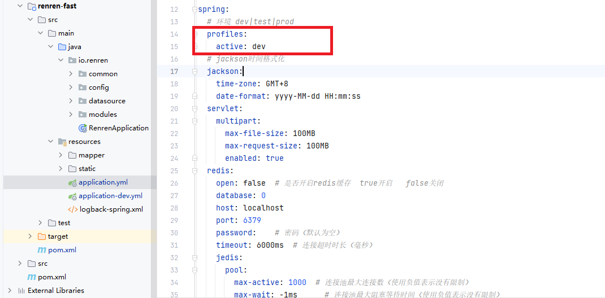
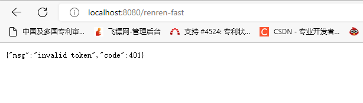

##### 创建项目

1. new 一个springboot·新项目，取名gulimall，导入 web和openFeign 包，删除启动类

2.  创建模块 gulimall - product 模块并手写启动类，改为jar包

3. 创建模块  gulimall -  ware 模块并手写启动类，改为jar包

4. 创建模块  gulimall -  order 模块并手写启动类，改为jar包

5. 创建模块  gulimall -  coupon 模块并手写启动类，改为jar包

6. 创建模块  gulimall -  member 模块并手写启动类，改为jar包

   

##### 创建数据库

 建立了以下数据库 

> -  gulimall_oms
> -  gulimall_pms
> -  gulimall_sms
> -  gulimall_ums
> -  gulimall_wms 
>
>  字符集选utf8mb4，他能兼容utf8且能解决一些乱码的问题 

##### 快速开发

使用人人开源项目


######  后台管理

>**renren-fast 项目**
>
>git clone https://gitee.com/renrenio/renren-fast.git 
>
>
>
>**删除renren-fast中的.git文件，把其余文件拷贝到项目中**
>
>
>
>**pom.xml报错**
>
>```java
>'parent.relativePath' of POM io.renren:renren-fast:3.0.0
>```
>
>报错原因：子模块的parent写的并不是子模块的上一级，而是继承了springboot 
>
>解决方法：在parent标签之中添加 
>
>```pom
>	<parent>
>		<groupId>org.springframework.boot</groupId>
>		<artifactId>spring-boot-starter-parent</artifactId>
>		<version>2.2.4.RELEASE</version>
>		<relativePath />
>	</parent>
>```
>
>
>
>**如果pom.xml之中的plugin地方报错，引入相关依赖**
>
>```yml
><!-- https://mvnrepository.com/artifact/com.spotify/docker-maven-plugin -->
><dependency>
><groupId>com.spotify</groupId>
><artifactId>docker-maven-plugin</artifactId>
><version>0.4.14</version>
></dependency>
>
><dependency>
>	<groupId>org.codehaus.mojo</groupId>
>	<artifactId>wagon-maven-plugin</artifactId>
>	<version>1.0</version>
></dependency>
>
>```
>
>
>
>**创建数据库gulimall_admin**
>
>sql文件在renren-fast/db/ 目录下，找到其中的mysql.sql 复制，运行。 
>
>
>
>**修改renren-fast的配置文件、配置数据库**
>
>查看application.yml，发现当前环境为dev 
>
>
>
>修改application-dev.yml, 配置成自己的数据源 
>
>
>
>**启动成功，访问http://localhost:8080/renren-fast** 
>
>
>
>测试成功 


###### 前端框架

> **renren-fast-vue项目** 
>
> git clone https://gitee.com/renrenio/renren-fast-vue.git 
>
> 
>
> 下载到了桌面，我们把renren-fast移动到我们的项目文件夹（删掉.git文件） 
>
> 
>
> **需要安装node**
>
> 
>
> **配置淘宝镜像** 
>
> ```java
> npm config set registry http://registry.npm.taobao.org/
> ```
>
> 
>
> **运行npm install命令，加载项目依赖**
>
> 
>
> **执行命令npm run dev运行项目** 


##### 逆向工程搭建

>**renren-generator项目**
>
>git clone https://gitee.com/renrenio/renren-generator.git 
>
>
>
>**删除其中的.git文件，复制到工程中，添加到父工程** 
>
>
>
>**修改renren-generator的配置文件application.yml，配置自己的数据源** 
>
>生成gulimall-pms 

